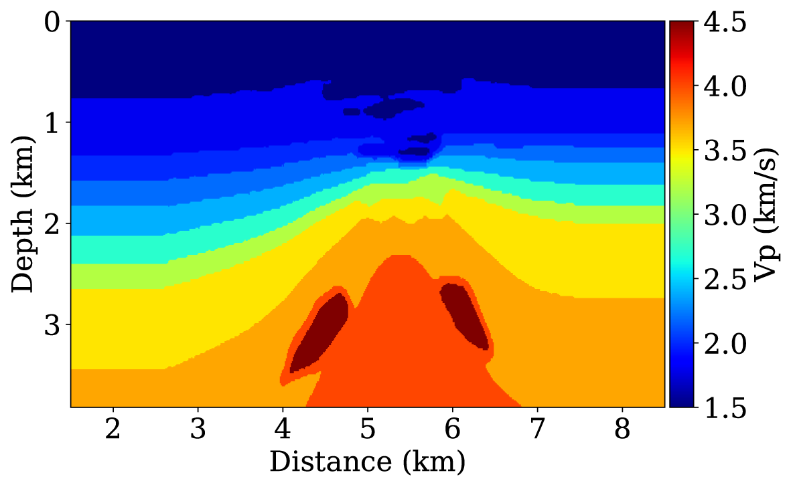
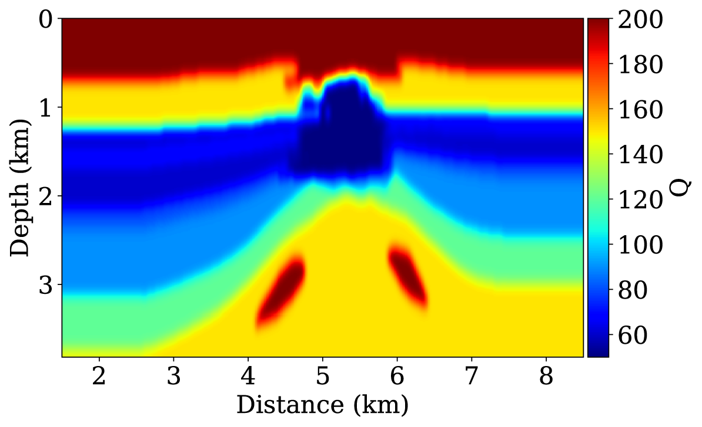

# Velocity-and-attenuation-models-of-BP-Gas-Reservoir1.0

This is a gas reservoir model with both P-wave velocity and Qp parameters. We build this model by modifying the right part of the original BP model, which can be used for seismic modeling, migration and inversion study. 

The model files are RSF format. The detailed RSF format is shown in the Madagascar software website (www.ahay.org). 

When using this model, please cite the following references:

@article{10.1093/gji/ggy323,
    author = {Yang, Jidong and Zhu, Hejun},
    title = "{A time-domain complex-valued wave equation for modelling visco-acoustic wave propagation}",
    journal = {Geophysical Journal International},
    volume = {215},
    number = {2},
    pages = {1064-1079},
    year = {2018},
    month = {08},
    issn = {0956-540X},
    doi = {10.1093/gji/ggy323},
    url = {https://doi.org/10.1093/gji/ggy323},
    eprint = {https://academic.oup.com/gji/article-pdf/215/2/1064/25530487/ggy323.pdf},
}

@article{doi:10.1190/geo2018-0050.1,
author = {Jidong Yang and Hejun Zhu},
title = {Viscoacoustic reverse time migration using a time-domain complex-valued wave equation},
journal = {GEOPHYSICS},
volume = {83},
number = {6},
pages = {S505-S519},
year = {2018},
doi = {10.1190/geo2018-0050.1},
URL = {https://doi.org/10.1190/geo2018-0050.1},
eprint = {https://doi.org/10.1190/geo2018-0050.1}
}

@article{doi:10.1190/geo2018-0804.1,
author = {Jidong Yang and Hejun Zhu},
title = {Viscoacoustic least-squares reverse time migration using a time-domain complex-valued wave equation},
journal = {GEOPHYSICS},
volume = {84},
number = {5},
pages = {S479-S499},
year = {2019},
doi = {10.1190/geo2018-0804.1},=
URL = {https://doi.org/10.1190/geo2018-0804.1},
eprint = https://doi.org/10.1190/geo2018-0804.1}
}

@article{https://doi.org/10.1029/2019JB019129,
author = {Yang, Jidong and Zhu, Hejun and Li, Xueyan and Ren, Li and Zhang, Shuo},
title = {Estimating P Wave Velocity and Attenuation Structures Using Full Waveform Inversion Based on a Time Domain Complex-Valued Viscoacoustic Wave Equation: The Method},
journal = {Journal of Geophysical Research: Solid Earth},
volume = {125},
number = {6},
pages = {e2019JB019129},
keywords = {seismic attenuation, seismic inversion, computational seismology},
doi = {https://doi.org/10.1029/2019JB019129},
url = {https://agupubs.onlinelibrary.wiley.com/doi/abs/10.1029/2019JB019129},
eprint = {https://agupubs.onlinelibrary.wiley.com/doi/pdf/10.1029/2019JB019129},
note = {e2019JB019129 10.1029/2019JB019129},
year = {2020}
}
